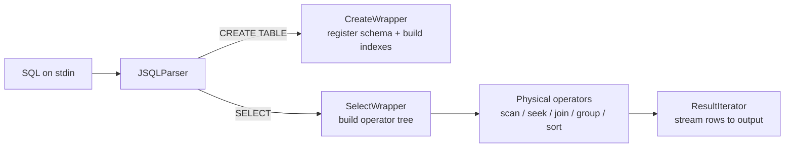

# SQL-Engine-CSE-562

A SQL query engine built from the ground up in Java (course project, CSE 562 — *Implementation of Database Systems*; internal codename **dubstep**). It parses SQL, plans a physical operator tree, and executes queries over pipe‑delimited CSV tables using a Volcano‑style iterator model — with **B+Tree indexing** and **external‑memory sorting** for performance on large, TPC‑H‑style datasets.

---

## Features

- **SQL front end** via [JSQLParser](http://jsqlparser.sourceforge.net/) — `CREATE TABLE` and `SELECT` (including `UNION`).
- **Volcano/iterator execution model** — every operator implements a common `hasNext()/next()` interface and pulls tuples lazily from its child, so operators compose into a pipeline without materializing intermediates.
- **Rich operator set**: selection, projection, aggregation, `GROUP BY`, `ORDER BY`, `LIMIT`, and four join strategies.
- **Multiple join algorithms**: nested‑loop, hash join, sort‑merge join, and **index nested‑loop join**.
- **B+Tree indexing**:
  - **Primary (clustered)** index — leverages a sorted CSV so a lookup seeks once and streams forward.
  - **Secondary (non‑clustered)** index — posting lists over an unsorted column, one seek per matching row. *(See [Indexing](#indexing).)*
- **External‑memory sort‑merge** — spills sorted runs to disk in fixed‑size blocks, so sorting scales beyond memory.
- **Data types**: `INT`, `DECIMAL`, `CHAR`, `VARCHAR`, `DATE`.

---

## Architecture

### Query lifecycle



`dubstep/Main.java` is a REPL: it reads from standard input, treats `;` as the statement terminator, and dispatches each statement. On startup it replays any persisted `CREATE TABLE` statements (from `createDB/`) so schema and indexes are rebuilt before queries run.

### Execution model

All operators implement `iterators.DefaultIterator`:

```java
public interface DefaultIterator {
    boolean hasNext();
    List<PrimitiveValue> next();
    void reset();
    List<String> getColumns();
}
```

Operators are composed into a tree by `queryexec.SelectWrapper`. Rows flow up on demand (pull‑based), so a query like *filter → join → group → sort* streams tuples through the pipeline instead of building full intermediate tables.

| Operator | Class |
|----------|-------|
| Full table scan | `TableScanIterator` |
| Primary index seek | `TableSeekIterator` |
| Secondary index seek | `SecondarySeekIterator` |
| Selection (`WHERE`) | `SelectionIterator` |
| Projection (`SELECT` list) | `ProjectionIterator` |
| Nested‑loop join | `JoinIterator` |
| Hash join | `HashJoinIterator` |
| Sort‑merge join | `SortMergeIterator` |
| Index nested‑loop join | `IndexJoinIterator` |
| Aggregation / `GROUP BY` | `SimpleAggregateIterator`, `GroupByIterator` |
| `ORDER BY` | `OrderByIterator` |
| `LIMIT` | `LimitIterator` |
| `UNION` | `interfaces.UnionWrapper` |

---

## Indexing

Indexes are declared inside `CREATE TABLE` and built at table‑creation time. Both kinds are B+Trees whose leaves map a key to **byte offsets** into the table's CSV; a lookup then `seek()`s straight to the right position with `RandomAccessFile` instead of scanning from the top.

```sql
CREATE TABLE LINEITEM(
  ORDERKEY INT,
  LINENUMBER INT,
  SHIPDATE DATE,
  RETURNFLAG CHAR(1),
  ...
  PRIMARY KEY (ORDERKEY, LINENUMBER),   -- clustered index
  INDEX SHIPDATE (SHIPDATE),            -- secondary indexes
  INDEX RETURNFLAG (RETURNFLAG));
```

### Primary (clustered) index

Assumes the CSV is **physically sorted on the key**. Because rows sharing a key are contiguous, the tree stores a single offset per key: a lookup seeks once, then reads forward until the key changes.

```
key = 30  ──►  BPlusTree.search(30) ──► offset 84 ──► seek(84), read forward
```

Built by `bPlusTree.BPlusTreeBuilder`; consumed by `TableSeekIterator`. There can be only one clustered index per table (a file has one physical order).

### Secondary (non‑clustered) index

Indexes a column that is **not** the file's sort order, so matching rows are scattered. Each key therefore maps to a **posting list** — every matching row's offset — and lookups do one seek per row.

```
dept = 5  ──►  posting list [42, 210, 588] ──► seek each, read one row
```

`bPlusTree.SecondaryBPlusTree` reuses the existing `BPlusTree` (each distinct key → an index into a side posting‑list store), so the primary path is untouched. Consumed by `SecondarySeekIterator`. Secondary indexes are *dense* (one pointer per row) and a table may have many. Registered in `SchemaStructure.secondaryIndexMap`, separate from the primary `bTreeMap`.

| | Primary (clustered) | Secondary (non‑clustered) |
|---|---|---|
| Requires sorted file? | Yes | No |
| Value per key | Single offset | Posting list of offsets |
| Lookup | Seek once, read forward | One seek per matching row |
| Per table | One | Many |

---

## Getting started

### Prerequisites

- **JDK 8+** (`javac`, `java`)
- Bundled dependencies in `lib/`: `jsqlparser-1.0.0.jar`, `evallib-1.0.jar`

### Configure the data directory

Edit `utils/Config.java` and point `databasePath` at the folder holding your CSV files:

```java
public static String databasePath = "/path/to/your/data/";
```

### Build

```bash
find src -name "*.java" > sources.txt
javac -cp "lib/jsqlparser-1.0.0.jar:lib/evallib-1.0.jar" -d bin @sources.txt
```

On Windows, use `;` instead of `:` as the classpath separator.

### Run

The engine reads SQL from standard input (statements separated by `;`). Pipe a script in:

```bash
java -cp "bin:lib/jsqlparser-1.0.0.jar:lib/evallib-1.0.jar" dubstep.Main < queries.sql
```

Add `--in-mem` to force in‑memory execution:

```bash
java -cp "bin:lib/jsqlparser-1.0.0.jar:lib/evallib-1.0.jar" dubstep.Main --in-mem < queries.sql
```

`queries.sql` in the repo root contains a full TPC‑H‑style schema and example queries to get started.

---

## Data format

Tables are stored as **pipe‑delimited** (`|`) text files named `<TABLE>.csv` inside `databasePath`, with columns in the order declared in `CREATE TABLE`:

```
1|155190|7706|1|17|21168.23|0.04|0.02|N|O|1996-03-13|1996-02-12|...
```

Dates are `yyyy-mm-dd`. There is no header row — column names and types come from the registered schema.

---

## Project layout

```
src/
  dubstep/        Main — REPL entry point
  queryexec/      CreateWrapper, SelectWrapper, GroupByWrapper
  iterators/      Physical operators (scan, seek, joins, group, sort, ...)
  bPlusTree/      BPlusTree, BPlusTreeBuilder (primary), SecondaryBPlusTree
  objects/        SchemaStructure, ColumnDefs, IndexDef
  utils/          Config, Constants, Optimzer, EvaluateUtils, Utils
  FileUtils/      Output/file writers
  interfaces/     UnionWrapper
lib/              JSQLParser + evallib jars
queries.sql       Example TPC-H-style schema + queries
```

Working directories `createDB/`, `bPlusTreeDir/`, `tempfolder/`, and `bin/` are generated at runtime and are git‑ignored.

---

## Notes and limitations

- **Read‑oriented**: the engine focuses on `CREATE TABLE` + `SELECT`. `INSERT`/`UPDATE`/`DELETE` are not part of the query path; because posting lists store raw byte offsets, indexes assume the CSV is immutable after build.
- **Primary index requires sorted input** on the key column; unsorted primary keys should be sorted at load time.
- `Config.databasePath` is currently a hard‑coded path and must be set for your environment.

## Possible future work

- Planner routing so equality / `IN` predicates on a secondary‑indexed column automatically use the secondary seek path, and index joins fire on secondary columns.
- Cost‑based operator selection (index scan vs. full scan by selectivity).
- Persisting secondary indexes to disk (the primary index already serializes to `bPlusTreeDir/`).
